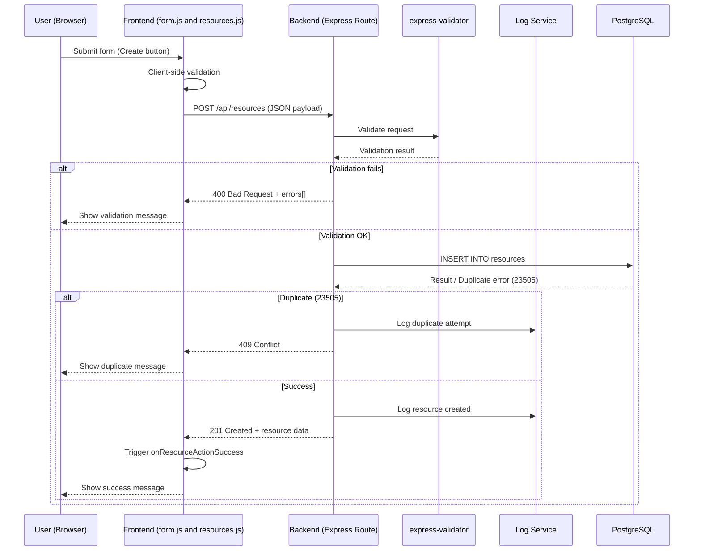
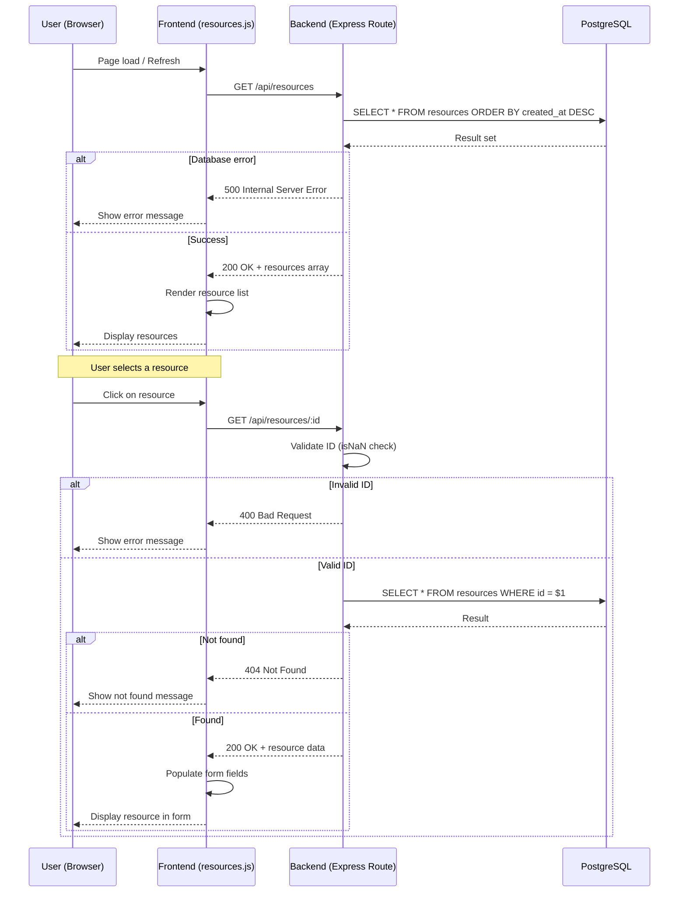
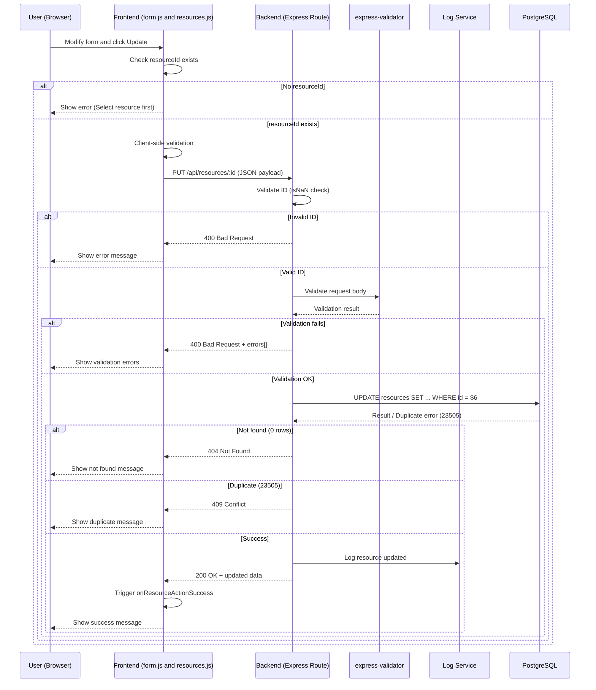
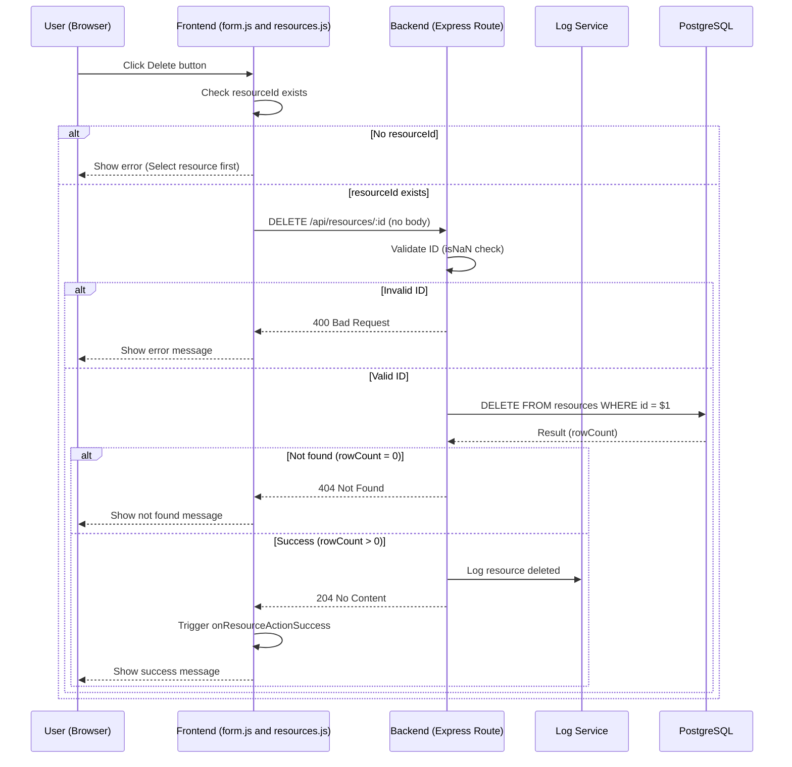

# G1 CRUD Data Flow - Booking System Phase6

This document models the complete CRUD (Create, Read, Update, Delete) operations for Resources in the Booking System Phase6, based on actual implementation verified through Developer Tools.

---

## 1️⃣ CREATE – Resource (Sequence Diagram)

**Endpoint:** `POST /api/resources`

**Success:** 201 Created with resource data

**Failures:**
- 400 Bad Request: Validation errors
- 409 Conflict: Duplicate resource name
- 500 Internal Server Error: Database error

---

## 2️⃣ READ – Resources (Sequence Diagram)

**Endpoints:**
- `GET /api/resources` - Read all resources
- `GET /api/resources/:id` - Read single resource

**Success:**
- 200 OK with data (array or single object)

**Failures:**
- 400 Bad Request: Invalid ID format
- 404 Not Found: Resource doesn't exist
- 500 Internal Server Error: Database error

---

## 3️⃣ UPDATE – Resource (Sequence Diagram)

**Endpoint:** `PUT /api/resources/:id`

**Success:** 200 OK with updated resource data

**Failures:**
- 400 Bad Request: Invalid ID or validation errors
- 404 Not Found: Resource doesn't exist
- 409 Conflict: Duplicate resource name
- 500 Internal Server Error: Database error

---

## 4️⃣ DELETE – Resource (Sequence Diagram)

**Endpoint:** `DELETE /api/resources/:id`

**Success:** 204 No Content (no response body)

**Failures:**
- 400 Bad Request: Invalid ID format
- 404 Not Found: Resource doesn't exist
- 500 Internal Server Error: Database error

---

## Verification Methods Used

1. **Browser Developer Tools:**
   - Network tab: Verified endpoints, methods, payloads, status codes
   - Console tab: Monitored client-side logs and errors

2. **Code Analysis:**
   - Backend routes: `/tmp/phase6/src/routes/resources.routes.js`
   - Frontend logic: `/tmp/phase6/public/form.js` and `/tmp/phase6/public/resources.js`
   - Validators: `/tmp/phase6/src/validators/resource.validators.js`

3. **Testing:**
   - Deployed Phase6 locally
   - Tested each CRUD operation through UI
   - Verified success and failure paths

---

## Key Implementation Details

- **Logging:** All successful mutations (Create, Update, Delete) are logged via Log Service
- **Validation:** Uses express-validator for server-side validation
- **Duplicate Detection:** PostgreSQL unique constraint (23505 error code)
- **ID Validation:** NaN check before database queries
- **Frontend Callback:** `window.onResourceActionSuccess` notifies UI layer after successful operations
